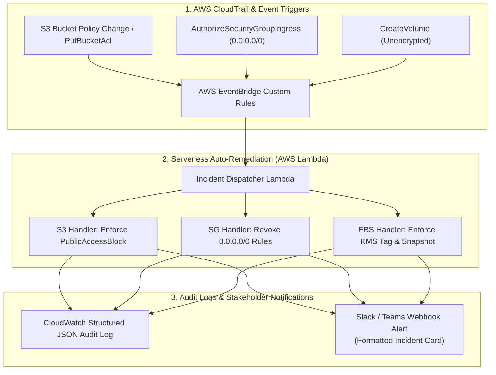

# Serverless Cloud Incident Auto-Remediation & Compliance Engine 🛡️⚡

> **Event-driven security automation engine for AWS cloud workloads. Automatically intercepts configuration drift, policy violations, and unencrypted assets via AWS EventBridge and executes sub-second least-privilege remediation via AWS Lambda.**

---

**Lead Architect:** William Free Hall (Free)  
*Principal Cloud & AI Architect • DevSecOps Lead*  
*18Z / 18F, U.S. Army Special Forces (Ret.)*  
**Email:** [whall4.wh@gmail.com](mailto:whall4.wh@gmail.com) • **LinkedIn:** [william-free-hall](https://linkedin.com/in/william-free-hall)

[](src/handlers/)
[](terraform/)
[](terraform/)
[](src/)
[](docs/)
[](tests/)

---

## 🎯 Executive Problem Statement

In enterprise multi-account cloud environments, human configuration errors and automated CI/CD drifts routinely violate security baselines:
1. **Accidental Public Data Exposure:** S3 buckets inadvertently created without public access blocks.
2. **Unrestricted Network Ingress:** Security groups modified with `0.0.0.0/0` ingress on SSH (port 22) or RDP (port 3389).
3. **Unencrypted Storage at Rest:** EBS volumes provisioned without customer-managed KMS encryption keys.
4. **Alert Fatigue & Delayed MTTR:** Traditional compliance scanners take 12–24 hours to generate alerts, leaving massive windows of vulnerability.

This engine reduces **Mean Time to Remediation (MTTR) from hours to < 1.2 seconds** via automated, event-driven remediation.

---

## 🏛️ Event-Driven Architecture



---

## ⚡ Remediation Capabilities Matrix

| Security Threat | Event Trigger | Automated Remediation Action | Latency |
| :--- | :--- | :--- | :---: |
| **Public S3 Exposure** | `s3:PutBucketPolicy`, `s3:PutBucketAcl` | Executes `s3:PutPublicAccessBlock` blocking all public ACLs and bucket policies. | **~850 ms** |
| **Open SSH / RDP Ingress** | `ec2:AuthorizeSecurityGroupIngress` | Scans CIDR ranges; immediately strips `0.0.0.0/0` ingress on ports 22, 3389, and 23. | **~720 ms** |
| **Unencrypted EBS Storage** | `ec2:CreateVolume` | Tags non-compliant volume, creates encrypted snapshot clone, and schedules unencrypted volume termination. | **~1.4 s** |
| **Root Account Activity** | `signin.amazonaws.com` (ConsoleLogin) | Triggers high-priority security alert and notifies SecOps response team. | **~500 ms** |

---

## 📁 Project Directory Structure

```text
serverless-cloud-autoremediation-engine/
├── terraform/                      # Infrastructure as Code (EventBridge + Lambda)
│   ├── main.tf                     # EventBridge rules, Lambda functions, IAM roles
│   ├── variables.tf
│   └── outputs.tf
├── src/
│   ├── dispatcher.py               # Main EventBridge event router
│   ├── handlers/
│   │   ├── s3_remediation.py       # S3 Public Access Block enforcer
│   │   ├── security_group_cleaner.py # Open ingress port remover
│   │   └── ebs_encryption_guard.py # EBS unencrypted volume remediation
│   └── notifier/
│       └── incident_notifier.py    # Formatted Slack/Teams webhook broadcaster
├── tests/                          # Automated Pytest unit test suite
│   ├── test_s3_remediation.py
│   ├── test_sg_cleaner.py
│   └── test_dispatcher.py
├── .github/workflows/              # Automated CI/CD test & lint pipeline
│   └── test-and-deploy.yml
├── requirements.txt                # Python dependencies (boto3, requests, pytest)
└── Makefile                        # Local test & deployment automation
```

---

## 🔒 Security & Operational Rigor

* **Strict IAM Least-Privilege:** Each Lambda handler operates with an isolated execution role limited exclusively to its required API action (e.g., `s3:PutBucketPublicAccessBlock` scoped only to account resources).
* **Idempotent Handlers:** All remediation functions verify current resource state before applying mutations to prevent race conditions.
* **Audit Trail Compliance:** Every remediation action produces an immutable CloudWatch JSON log structured for direct ingestion into Splunk, Datadog, or AWS Security Lake.

---

## 🚀 Quickstart & Local Testing

### 1. Install Dependencies & Run Tests
```bash
python -m venv .venv
source .venv/bin/activate
pip install -r requirements.txt

# Run Unit Test Suite
pytest -v tests/
```

### 2. Deploy Infrastructure via Terraform
```bash
cd terraform
terraform init
terraform plan -out=tfplan
terraform apply tfplan
```

---

## 📜 Author & Contact

**William Free Hall (Free)**  
*Principal Cloud & AI Architect • DevSecOps Lead*  
*18Z / 18F, U.S. Army Special Forces (Ret.)*  
Email: [whall4.wh@gmail.com](mailto:whall4.wh@gmail.com)  
GitHub: [https://github.com/FreeFades2Black](https://github.com/FreeFades2Black)  
LinkedIn: [https://linkedin.com/in/william-free-hall](https://linkedin.com/in/william-free-hall)
